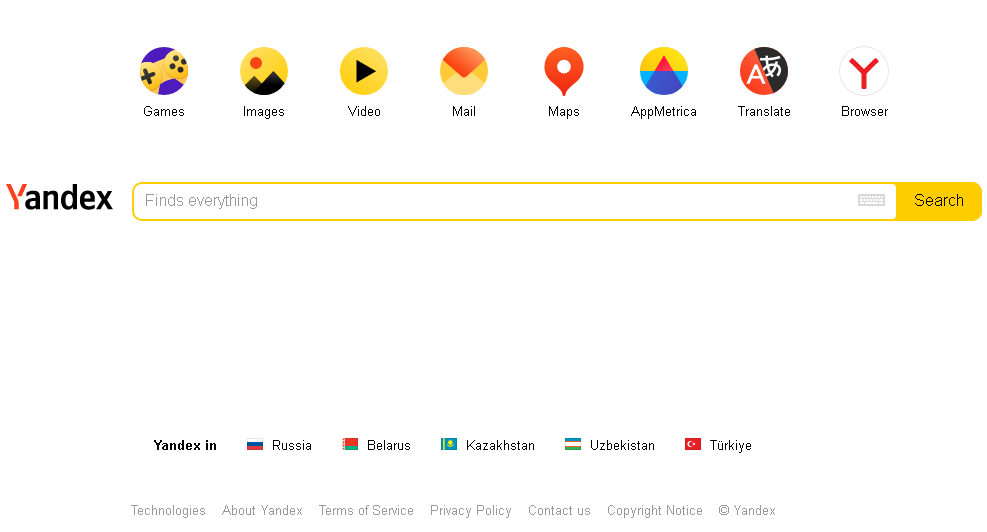

## Задача 
На основе сайта yandex.ru:
1. Определите, на каком протоколе работает сайт.
2. Проанализируйте структуру страницы сайта.
3. Внесите не менее 10 изменений на страницу с помощью инструмента разработчика и представьте скриншоты было/стало.
4. Создайте прототип низкой детализации (дополнительное задание, если на семинаре дошли до задания №8).

## Решение
Данное задание написано в формате [MarkDown и размещено
на гитхабе](https://github.com/Scorppb/geek-web/tree/main/01), где его лучше и просматривать.

Т.к. Яндекс.Дзен с доменом dzen.ru продан VK, и яндекс решил поддержать старый проект, то при вводе yandex.ru в строке поиска происходит редирект на dzen.ru.
Но, yandex с другими зонами (доменами первого уровня) имеет, пока, старый вид, поэтому буду выполнять задание с доменом yandex.com.
### 1. Определите, на каком протоколе работает сайт
Как видно на скрине, сайт работает по защищенному протоколу HTTPS

### 2. Проанализируйте структуру страницы сайта
Главная страница yandex.com состоит из трех основных блоков:
- шапка
- зона контента
- подвал

### 3. Внесите не менее 10 изменений на страницу с помощью инструмента разработчика и представьте скриншоты было/стало
Исходная страница:

Найдите 10 отличий:

### 4. Создайте прототип низкой детализации
Прототип yandex.com

